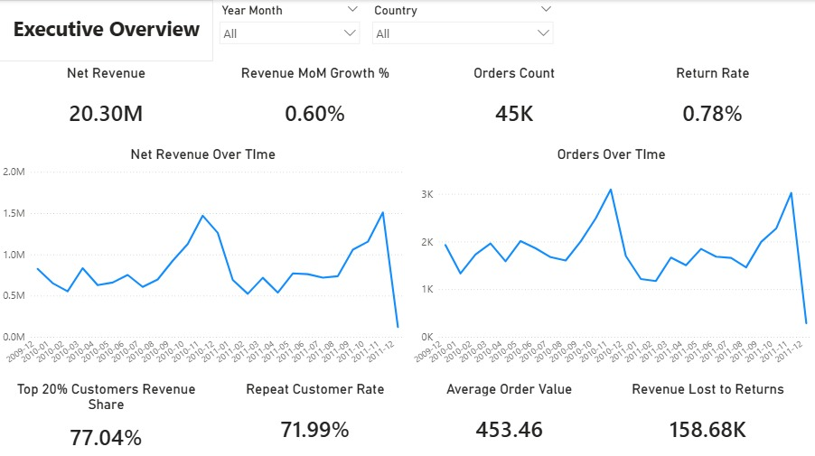
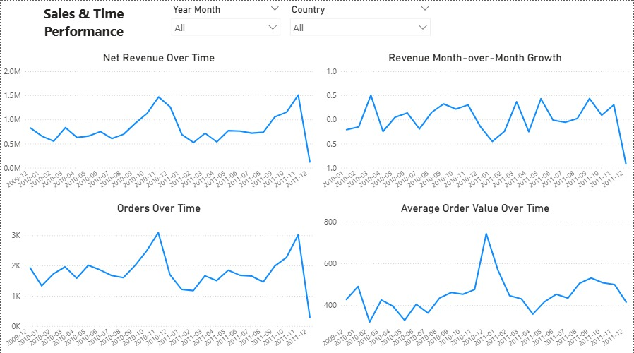
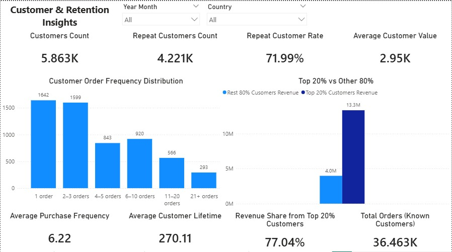

**Online Retail II — Advanced Analytics**

**Project Overview**

This project analyzes sales performance, customer behavior, and return-related risks for a UK-based e-commerce business using the Online Retail II (UCI) dataset covering the period 2009–2011.

The goal of the project is to demonstrate business-focused analytics, including:
- revenue and growth analysis
- customer retention and value assessment
- revenue concentration (Pareto-style insights)
- return impact and risk analysis

The project is designed as a Data Analyst portfolio case, with a strong emphasis on business reasoning and clear storytelling rather than technical complexity.

**Tools Used**
- Python (pandas) — data cleaning and feature preparation
- PostgreSQL — analytical SQL analysis
- Power BI — data modeling, DAX measures, and dashboard creation
- Jupyter Notebooks — analysis documentation and insight summaries

**Data Overview**

The analysis is based on transactional data at the invoice-line level, including:
- orders and products
- customers (when identified)
- returns treated as negative revenue

Customer-level analysis is performed only for identified customers, while sales metrics include both identified and guest purchases.

**Dashboard Structure**

The Power BI dashboard consists of four analytical pages:

**1. Executive Overview**

### Executive Overview

High-level view of business health, including:
- net revenue and growth
- order volume
- return rate and revenue loss
- customer loyalty and revenue concentration

**2. Sales & Time Performance**

Analysis of revenue trends and growth drivers:
- revenue and orders over time
- month-over-month growth
- average order value trends

**3. Customer & Retention Insights**

Customer-focused analysis:
- customer base size and repeat rate
- purchase frequency and lifetime
- revenue concentration among top customers

**4. Returns & Risk Analysis**

Assessment of return-related risk:
- return frequency and financial impact
- return trends over time
- products with the highest return impact

**Key Insights**

- The business generated 20.3M in net revenue supported by approximately 45K orders.
- Revenue growth is positive but modest, indicating a mature business.
- Sales performance is primarily driven by order volume, not by increasing order value.
- Customer loyalty is strong, with ~72% repeat customers, but revenue is highly concentrated among top customers.
- Returns are infrequent and declining in impact, but still result in measurable revenue loss and are concentrated in specific products.

**Business Risks & Opportunities**

**Risks**
- High dependency on a small group of high-value customers
- Revenue volatility driven by fluctuating order volume
- Limited visibility into guest customer behavior

**Opportunities**
- Strengthen retention of high-value customers
- Increase repeat purchases among low-frequency buyers
- Reduce return losses through targeted product-level actions
- Improve customer identification to enhance retention analysis

**Project Outcome**

This project demonstrates the ability to:
- translate raw transactional data into business insights
- design an analytical data model suitable for BI tools
- build dashboards that answer real business questions
- communicate findings clearly to non-technical stakeholders

The final output includes a Power BI dashboard and a written insights summary.

**Limitations**

- The dataset is historical (2009–2011).
- Customer-level insights are limited to identified customers.
- Profitability and marketing data are not available.

**Author**

**Mykola Trybushkin**
Data Analyst / Web Developer